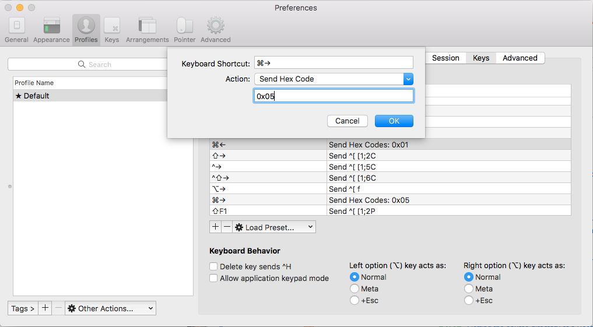

[](https://forthebadge.com)   **But it is**  [](https://forthebadge.com)  

### Configurations

***

- [Configurations](#configurations)
  - [Iterm2/Terminal configurations](#iterm2terminal-configurations)
    - [Zsh plugins](#zsh-plugins)
    - [Install Fonts](#install-fonts)
    - [Get better version of man pages](#get-better-version-of-man-pages)
    - [Install Ruby](#install-ruby)
    - [Make ls, ll commands colorful](#make-ls-ll-commands-colorful)
    - [Optional powerlevel10k Configuration](#powerlevel10k-configuration)
    - [iterm2 color theme](#iterm2-color-theme)
    - [Terminal File Manager](#terminal-file-manager)
    - [Uniform Commits for git projects](#uniform-commit-message-format)
    - [fig autocomplete](#fig-autocomplete)
  - [List Of Shell Customization frameworks](#list-of-shell-customization-frameworks)
  - [Python setup](#python-setup)
    - [Virtual Environment for python](#virtual-environment-for-python)
  - [GO setup](#go-setup)
    - [Environment variables](#environment-variables)
  - [Groovy setup](#groovy-setup)
  - [IntelliJ idea settings](#intellij-idea-settings)
  - [Multiple java versions in mac](#multiple-java-versions-in-mac)
  - [SDKMAN](#sdkman)
  - [Postman Configs](#postman-configs)
  - [Keychain-password](#keychain-password)
  - [video tutorials](#video-tutorials)
  - [Basic Mac setup](#basic-mac-setup)
  - [Softwares](#softwares)
  - [Application Initializers](#application-initializers)

***


<a href="#configurations">:arrow_up:</a> 
#### Iterm2/Terminal configurations

Note: Make sure you have *local admin rights* before you proceed with the following installations.

Following site will help you setup your mac.

1. Install iterm2 from https://www.iterm2.com/ and Install Homebrew from https://brew.sh/ 

2. Install software listed in file brew-leaves.txt   
   `brew install $(< brew-leaves.txt)`

3. Add theme to iterm2: [Oh-my-Z](https://ohmyz.sh/)   
   ```shell
    sh -c "$(curl -fsSL https://raw.github.com/ohmyzsh/ohmyzsh/master/tools/install.sh)"
   ```

4. Add additional plugins, themes and fonts to iterm2  

   ##### Zsh plugins

   You can add additional plugins in zsh at `.oh-my-zsh/custom/plugins` location

   ```shell
   cd $ZSH/custom/plugins;git clone https://github.com/zsh-users/zsh-syntax-highlighting.git && git clone https://github.com/zsh-users/zsh-autosuggestions && git clone https://github.com/zsh-users/zsh-completions
   ```

   ##### Install Fonts
   
   ```bash
   brew tap homebrew/cask-fonts
   brew install --cask font-hack-nerd-font

   # powerline clone
   git clone https://github.com/powerline/fonts.git --depth=1
   # install
   cd fonts
   ./install.sh
   # clean-up a bit
   cd ..
   rm -rf fonts
   ```

   [source-code-pro](https://github.com/adobe-fonts/source-code-pro)

   [powerline fonts](https://github.com/powerline/fonts)

   [awesome-terminal-fonts](https://github.com/gabrielelana/awesome-terminal-fonts)

   [nerd-fonts](https://github.com/ryanoasis/nerd-fonts)
   
   [nerd-fonts](https://www.nerdfonts.com/)

5. Install powerlevel10k theme(`brew install powerlevel10k`)
6. Update [.zshrc](https://github.com/dineshbhagat/mac-configurations/blob/d220ae87fa8351adf7ba63db73f6a91b2fb866cb/.zshrc) file
7. change fonts for iterm2: iTerm2 -> Preferences -> Profiles -> Text -> Font -> Change Font to hack-nerd
8. Execute `compaudit | xargs chmod g-w,o-w /usr/local/share/zsh ;compaudit | xargs chmod g-w,o-w /usr/local/share/zsh/site-functions`
9. change font settings as shown in image  
   
10. Vim Customization 

    ```shell
      git clone https://github.com/amix/vimrc.git ~/.vim_runtime && sh ~/.vim_runtime/install_awesome_vimrc.sh
    ```

11. Customize iterm2 [shortcut](https://stackoverflow.com/a/10485061/2987755)  
    

    ⌘←  "SEND HEX CODE"      0x01  
    ⌘→  "SEND HEX CODE"      0x05  
    ⌥←  "SEND ESC SEQ"  b  
    ⌥→  "SEND ESC SEQ"  f  

12. Bonus: If you want terminal app to be similar to iterm2 do following settings
    - terminal -> preference -> Basic theme ->Background -> change color from white to black, 
    - Text -> change color from black to white
    - Font -> change for to Hack bold nerd font  

More info:

- [nicolashery/mac-dev-setup](https://github.com/nicolashery/mac-dev-setup)

- [donnemartin/dev-setup](https://github.com/donnemartin/dev-setup)

- [sourabhbajaj/mac-setup/](https://sourabhbajaj.com/mac-setup/)

- [andreafrancia/trash-cli](https://github.com/andreafrancia/trash-cli)

- [pimpyourterminal/blob/master/.zshrc](https://github.com/codetalkchannel/pimpyourterminal/blob/master/.zshrc)

- [zsh-users](https://github.com/zsh-users)

- [help.github](https://help.github.com/en)

Following are other changes require to make iterm more customizable and solutions to some problem I have encountered so far.

##### Get better version of man pages

https://tldr.sh/

##### Install Ruby

```shell
brew install rbenv ruby-build

# Add rbenv to bash/zsh (.bash_profile/.zshrc) so that it loads every time you open a terminal
echo 'if which rbenv > /dev/null; then eval "$(rbenv init -)"; fi' >> ~/.bash_profile
source ~/.bash_profile

echo 'if which rbenv > /dev/null; then eval "$(rbenv init -)"; fi' >> ~/.zshrc
source ~/.zshrc

# If you're using Zsh
echo 'export PATH="$HOME/.gem/ruby/2.7.2/bin:$PATH"' >> ~/.zshrc
echo 'export PATH="/usr/local/opt/ruby/bin:$PATH"' >> ~/.zshrc

# If you're using Bash
echo 'export PATH="$HOME/.gem/ruby/2.7.2/bin:$PATH"' >> ~/.bash_profile

# Install Ruby
rbenv install 2.7.2
rbenv global 2.7.2
ruby -v

rbenv rehash

# to check outdated gems
gem outdated

#update all outdated gems
sudo gem update

# delete older gems
sudo gem cleanup
```

 The first thing you want to do after installing a new Ruby version is to [install Bundler](https://github.com/nicolashery/mac-dev-setup#ruby).   
 This tool will allow you to set up separate environments for your different Ruby projects, so their required gem versions won't conflict with each other.  
 Install Bundler with:  

`gem install bundler`

 In a new Ruby project directory, create a new Gemfile with: like venv of python environment  
`bundle init`


##### Make ls, ll commands colorful

1. [exa](https://the.exa.website/)

   ```shell
   brew install exa
   ```

2. [LSD](https://github.com/Peltoche/lsd) --> **I liked this one** 

   ```shell
   brew install lsd
   alias ll='lsd -la'
   alias ls='lsd'
   ```
3. [colorls](https://github.com/athityakumar/colorls) --> slower compared to other plugins

   ```shell
   $sudo gem install colorls
   ```
   
Snapshots of my configurations:

```shell
+ — uncommitted changes in the index;
! — unstaged changes;
? — untracked changes;
$ — stashed changes;
⇣ — unpulled commits;
⇡ — unpushed commits
```


command-failure-status:


##### powerlevel10k configuration

1. To configure powerlevel10k, execute following command and choose suitable options for you

```bash
p10k configure
```

2. This will generate following files and you can have multiple files for each of the config 
```bash
mv ~/.p10k.zsh ~/.p10k.zsh.config1
```
To use desired config
```bash
cp ~/.p10k.zsh.config1 ~/.p10k.zsh
```
Restart the terminal.   


Other customizations you can try:
1. [🚀](https://spaceship-prompt.sh/)
2. [⭐🚢 == 🚀](https://starship.rs/)
3. [🐟🐚](https://fishshell.com/)

------

<a href="#configurations">:arrow_up:</a>
#### iterm2 color theme

The color scheme I have used in above iterm2 snapshots is [here](mac-configuration.itermcolors)

If you need different color schemes then you can [ref](https://github.com/sindresorhus/iterm2-snazzy)

- Download the colorscheme file
- double click on it, iterm2 will import it.

------

<a href="#configurations">:arrow_up:</a>  
#### Terminal File Manager

Installation:   
```bash
brew install nnn
```
OR     
Refer installation instructions from [here](https://github.com/jarun/nnn/wiki)   
OR   
This will add icons to directories and files   
Note: Nerd fonts should be installed and configured.

```bash
wget https://github.com/jarun/nnn/archive/refs/heads/master.zip
tar -zxvf master.zip
cd nnn-master/
# Not Zero, but Alphabet O, you will get binary nnn in same folder and you can move this bonary to the place you want and use it.
sudo make O_NERD=1

# Since I have install nnn with homebrew and it does not give any colors and icons, so  compiled it manually and replaced nnn binary file
sudo cp nnn /usr/local/Cellar/nnn/4.0/bin/
alias nnn='nnn -de'
```


Plugins   
```bash
curl -Ls https://raw.githubusercontent.com/jarun/nnn/master/plugins/getplugs | sh
```
Plugins are installed to `${XDG_CONFIG_HOME:-$HOME/.config}/nnn/plugins`.

Add active plugin list to .zshrc/.bashrc file
```
export NNN_PLUG='f:finder;o:fzopen;p:mocplay;d:diffs;t:nmount;v:imgview'
```

Ref: 
- https://github.com/jarun/nnn

------

<a href="#configurations">:arrow_up:</a> 

#### Uniform commit message format

[commitizen](https://commitizen-tools.github.io/commitizen/)


**In case if you want to change message prompt and add additional types then edit following file**   
For "conventional_commits" type template   
File: [/usr/local/lib/python3.11/site-packages/commitizen/cz/conventional_commits/conventional_commits.py](https://github.com/dineshbhagat/mac-configurations/blob/7710d09503d9b8a08a6493db97fb262d579865b1/conventional_commits.py)

```python
class: class ConventionalCommitsCz(BaseCommitizen)
method: def questions(self)
 "choices": [
 // other existing choices, NOTE: key should be of single character and should not be used by existing choices
 {
    "value": "chore",
    "name": (
        "chor: changes that do not relate to a fix or feature and "
        "don't modify src or test files (for example updating dependencies)"
    ),
    "key": "h",
},
{
    "value": "revert",
    "name": (
        "revert: reverts a previous commit"
    ),
    "key": "z",
},
``` 
Similarly scope and subject can be modified.

Add `revert` and `chore` in schema patters as well

```python
    def schema_pattern(self) -> str:
        PATTERN = (
            r"(?s)"  # To explictly make . match new line
            r"(build|ci|chore|docs|feat|fix|perf|refactor|style|test|chore|revert|bump)"  # type
            r"(\(\S+\))?!?:"  # scope
            r"( [^\n\r]+)"  # subject
            r"((\n\n.*)|(\s*))?$"
        )
        return PATTERN
```

------

<a href="#configurations">:arrow_up:</a> 

#### [Fig Autocomplete](https://fig.io/)

```bash
brew install --cask fig
```

You can opt-out of all telemetry and crash reporting by running:   
```
fig settings telemetry.disabled true
```

Requires an emailId for the setup. :unamused:

------

<a href="#configurations">:arrow_up:</a> 

#### [List Of Shell Customization frameworks](https://github.com/alebcay/awesome-shell)


------

<a href="#configurations">:arrow_up:</a>  
#### Python setup

`brew install python@3`  

info:   
```bash
Python has been installed as
  /usr/local/bin/python3

Unversioned symlinks `python`, `python-config`, `pip` etc. pointing to
`python3`, `python3-config`, `pip3` etc., respectively, have been installed into
  /usr/local/opt/python/libexec/bin

If you need Homebrew's Python 2.7 run
  brew install python@2

You can install Python packages with
  pip3 install <package>
They will install into the site-package directory
  /usr/local/lib/python3.7/site-packages
```

`brew install python@2`

##### Virtual Environment for python

It offers flexibility in isolating multiple python environment and does not interfer with other virtual environment  
Package installed in one virtual environment will not be visible in other virtual environment  
Package installed in virtual environment will not be installed system wide hence it will not be available to all programs which uses system python setup.

System python installation path   
`/System/Library/Frameworks/Python.framework/`

Homebrew installed python path  
`/usr/local/Cellar/python/<version>/`

Let us us python3 for virtual environment  
`pip3 install virtualenv`

Setup virtual environment at any location, lets setup at home directory  
`virtualenv -p python3 ~/virtEnvPy3`

Activate virtual environment  

```shell
cd ~/virtEnvPy3
source bin/activate
```

Install any package for above virtual environment from terminal   
`pip install flask`

Deactivate environment
`deactivate`

on similar line we can create virtual environment for python2 as well  

Now, if you want to extract which all packages you installed   
```python
pip2 freeze > requirements-2.txt
# OR
pip3 freeze > requirements-3.txt
```

If you want to install all packages from `requirements.txt`   

```python
pip2 install -r requirements.txt
#OR
pip3 install --user -r requirements.txt
# pip3 install help
# --user --> Install to the Python user install directory for your platform.  
# Typically ~/.local/, or %APPDATA%\Python on Windows.  
# (See the Python documentation for site.USER_BASE for full details.
```

------

<a href="#configurations">:arrow_up:</a>  
#### GO setup
`brew install golang`  or `brew install go`
check version
`go version`

##### Environment variables
Your Go working directory (`GOPATH`) is where you store your Go code/additional libraries.
It is not mandatory to have your code at `go-workspace`.
It can be any path you choose but must be separate from your Go installation directory (`GOROOT`).

```shell
mkdir ${HOME}/go-workspace
# GO projects/program will be stored
mkdir ${HOME}/go-workspace/src
# packaged object will be stored  
mkdir ${HOME}/go-workspace/pkg
# compiled binary files will be stored  
mkdir ${HOME}/go-workspace/bin

export GOPATH="${HOME}/go-workspace"
export GOROOT="$(brew --prefix golang)/libexec"
export PATH="$PATH:${GOPATH}/bin:${GOROOT}/bin"
```
Import Go packages
`go get -u github.com/tednaleid/ganda` [Ref](https://github.com/tednaleid/ganda)


More Ref
1. https://golang.org/project/
2. [GO-info](go-info.md)
      
------
<a href="#configurations">:arrow_up:</a>  
#### Groovy setup
If you have existing groovy version installed remove it first  
`brew remove groovy`  
Then install SDK by  
`brew install groovysdk`  
`export GROOVY_HOME=/usr/local/opt/groovy/libexec`  
Point intelliJ idea to following path  
`/usr/local/Cellar/groovysdk/<version>/libexec`  
check version  
`groovy --version`  

Ref:
[1](https://stackoverflow.com/a/42952785/2987755)

------
<a href="#configurations">:arrow_up:</a>  
#### IntelliJ idea settings

For IntelliJ keymap, import [settings.jar](settings.jar)

[Fonts](https://www.jetbrains.com/lp/mono/)

------

#### Multiple java versions in mac

http://jdk.java.net/12/ unzip and use for latest features, this will not mess-up your mac java version and environment variables

------ 
<a href="#configurations">:arrow_up:</a>  
#### SDKMAN

Install:

```shell
curl -s "https://get.sdkman.io" | bash
source "$HOME/.sdkman/bin/sdkman-init.sh"
sdk version

```
Uninstall: 

```shell
tar zcvf ~/sdkman-backup_$(date +%F-%kh%M).tar.gz -C ~/ .sdkman
$ rm -rf ~/.sdkman
# remove following line from bashrc/zshrc
#THIS MUST BE AT THE END OF THE FILE FOR SDKMAN TO WORK!!!
[[ -s "/home/dudette/.sdkman/bin/sdkman-init.sh" ]] && source "/home/dudette/.sdkman/bin/sdkman-init.sh"

```

Update:  
`sdk update`

Usage:

```shell
# Docs: https://sdkman.io/usage
sdk install micronaut
sdk list micronaut
sdk uninstall micronaut 1.0.4
```

Install Java (multi distribution)

```bash
sdk list java
```

Available Java Versions

`>>>` indicates current default version

| Vendor        | Use | Version      | Dist    | Status     | Identifier       |
|---------------|-----|--------------|---------|------------|------------------|
| AdoptOpenJDK  |     | 15.0.0.j9    | adpt    |            | 15.0.0.j9-adpt   |      
|               | >>> | 11.0.8.hs    | adpt    | installed  | 11.0.8.hs-adpt   |
|               |     | 8.0.265.j9   | adpt    |            | 8.0.265.j9-adpt  |
|               |     | 8.0.265.hs   | adpt    |            | 8.0.265.hs-adpt  |
| Amazon        |     | 15.0.0       | amzn    |            | 15.0.0-amzn      |
|               |     | 11.0.8       | amzn    |            | 11.0.8-amzn      |
|               |     | 8.0.265      | amzn    |            | 8.0.265-amzn     |
| Azul Zulu     |     | 15.0.0       | zulu    |            | 15.0.0-zulu      |     
| BellSoft      |     | 15.0.0.fx    | librca  |            | 15.0.0.fx-librca |    
| GraalVM       |     | 20.2.0.r11   | grl     |            | 20.2.0.r11-grl   |     
| Java.net      |     | 16.ea.19     | open    |            | 16.ea.19-open    |       
| SAP           |     | 15.0.0       | sapmchn |            | 15.0.0-sapmchn   |
     

Use the Identifier for installation:   

```bash
# syntax
sdk install java <version-dist>
# e.g.
sdk install java 11.0.8.hs-adpt

```

Ref: https://sdkman.io/

------ 
<a href="#configurations">:arrow_up:</a>  
#### Postman Configs

[bearer token in pre-script and dynamic variables](postman.md)

------
<a href="#configurations">:arrow_up:</a> 
#### Keychain Password

[add/update/delete](Keychain-password.md)

[Ref for github pages](https://github.com/benbalter/jekyll-relative-links/)

------

#### video tutorials

If you still could not follow up the steps, follow steps mentioned in the video  
[Part1:https://www.youtube.com/watch?v=iwH1XqVjZOE](https://www.youtube.com/watch?v=iwH1XqVjZOE)  
[Part2:https://www.youtube.com/watch?v=UsKd9Y42Mo0](https://www.youtube.com/watch?v=UsKd9Y42Mo0).   

------

If your zsh is slower: 

- check shell loading time
  ```
  timezsh() {
     shell=${1-$SHELL}
     for i in $(seq 1 10); do /usr/bin/time $shell -i -c exit; done
   }
  timezsh 
  ```
- check its plugin loading time
  ```
   # Load all of the plugins that were defined in ~/.zshrc
   for plugin ($plugins); do
     timer=$(($(gdate +%s%N)/1000000))
     if [ -f $ZSH_CUSTOM/plugins/$plugin/$plugin.plugin.zsh ]; then
       source $ZSH_CUSTOM/plugins/$plugin/$plugin.plugin.zsh
     elif [ -f $ZSH/plugins/$plugin/$plugin.plugin.zsh ]; then
       source $ZSH/plugins/$plugin/$plugin.plugin.zsh
     fi
     now=$(($(gdate +%s%N)/1000000))
     elapsed=$(($now-$timer))
     echo $elapsed":" $plugin
   done
  ```
- zsh profiler module
  ```
  zmodload zsh/zprof
  zprof
  ```

[Ref](https://blog.mattclemente.com/2020/06/26/oh-my-zsh-slow-to-load.html#:~:text=We%20did%20it%20by%3A,environments%20using%20the%20evalcache%20plugin)

------
<a href="#configurations">:arrow_up:</a> 
### Basic Mac Setup

[These](basic-mac-configuration.md) are common solutions to problems faced while using mac.

------
<a href="#configurations">:arrow_up:</a> 
### Softwares

[These](softwarelist.md) softwares I find it useful and grateful to the people who take care of it.

------
<a href="#configurations">:arrow_up:</a> 
### Application Initializers

[Some of the useful application generators](application-initializers.md).

------

<a href="#configurations">:arrow_up:</a> 

[customize-iterm2.sh](https://gist.github.com/dineshbhagat/a4bdff5c011957f9950b9bebed7f5e30)



[Ref](https://github.com/jekyll/jekyll-gist)


------
